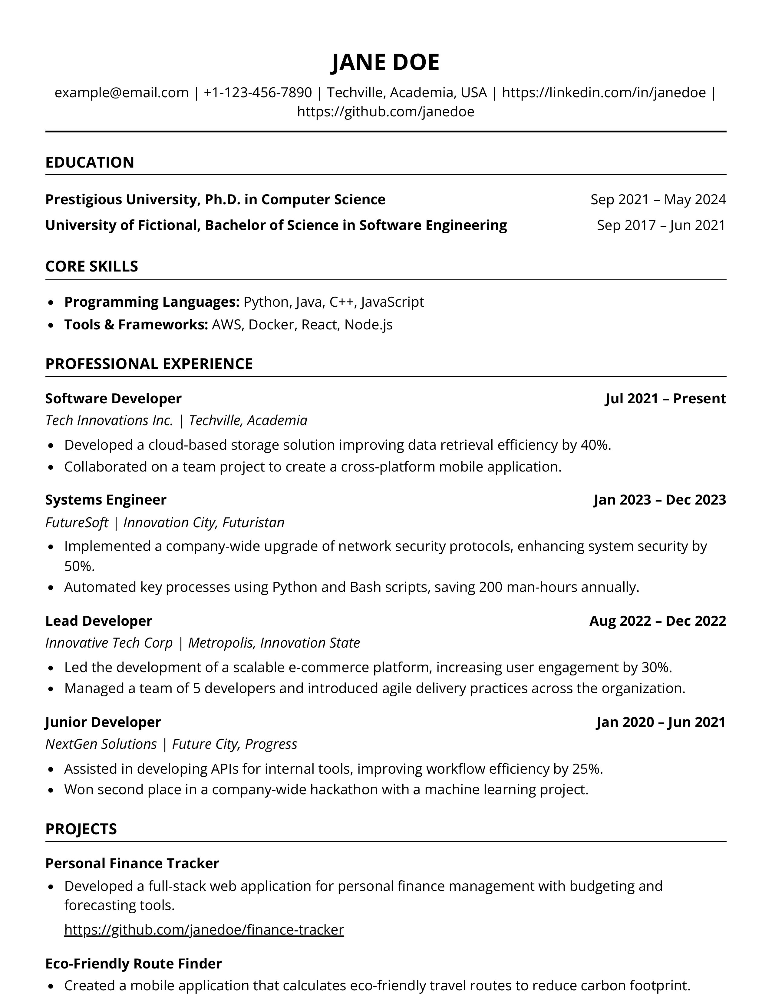
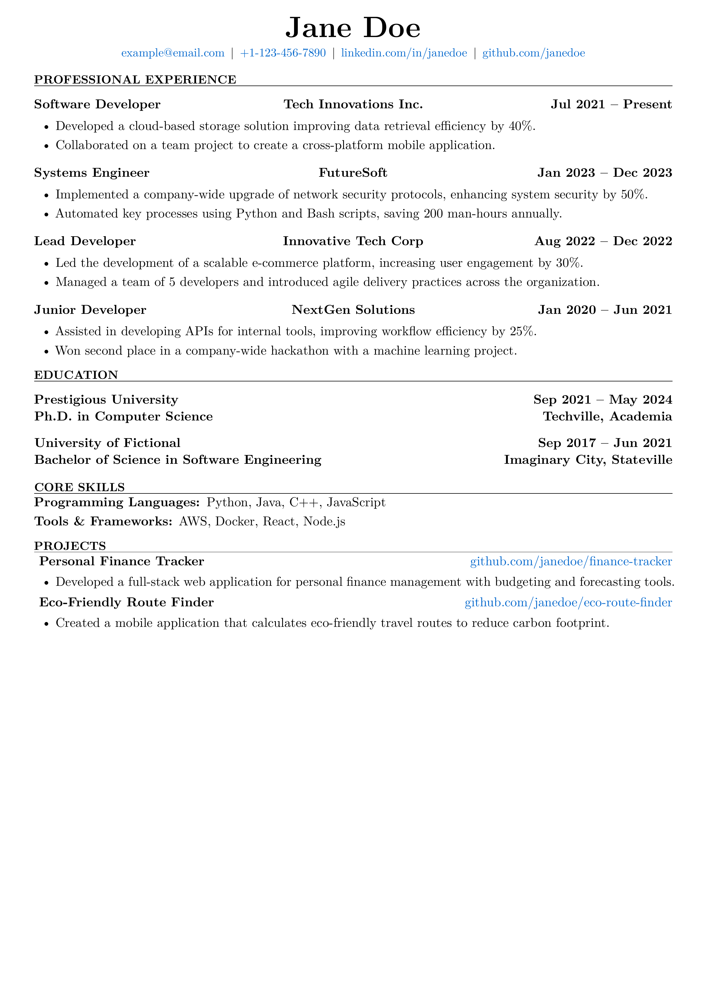

# Resume Generator

## Introduction

Resume Generator is a CLI-focused toolkit for turning structured configuration files into polished resumes. It supports multiple template formats and ships with a flexible template system so you can generate professional PDFs from LaTeX or HTML templates using YAML, JSON, or TOML data.

## Features

### Core Capabilities
- **Multiple Template Types**: Generate PDFs from LaTeX or HTML templates with the same data model
- **Data-Only Inputs**: Provide resume content as YAML, JSON, or TOML; the CLI selects templates and output targets
- **Template System**: Modular templates with embedded assets; customize or create new templates per project
- **Robust Path Resolution**: Works from any directory, supports `~`, relative paths, and dated output workspaces
- **Docker Support**: Containerized build that includes LaTeX and Chromium tooling for consistent output

### Technical Features
- **Docker Workflow**: Build the Go binary and supporting toolchain in a single container
- **CLI Commands**: Validate inputs, preview data, list templates, generate outputs, and export JSON schema
- **Schema Generation**: Generate JSON Schema for IDE integration and validation

## Prerequisites

### For CLI Usage
- Go 1.21+
- Chromium/Chrome (for HTML → PDF conversion)
- TeX Live or compatible LaTeX engine (for LaTeX → PDF conversion)

#### HTML → PDF Tool Selection
The generator auto-detects common converters (`wkhtmltopdf`, ungoogled-chromium, Chromium, Google Chrome). You can override the detection with the `RESUME_HTML_TO_PDF_TOOL` environment variable and point at a specific binary or `.app` bundle:

```bash
export RESUME_HTML_TO_PDF_TOOL="/Applications/ungoogled-chromium.app"
just generate
```

Per-run flags for Chromium-based browsers can still be appended via `RESUME_CHROMIUM_FLAGS` (for example, to add `--no-first-run`).

### Optional
- Docker (to run the bundled image)
- [just](https://github.com/casey/just) for helper commands

## Getting Started

### Quick Start

1. **Clone the Repository**
   ```bash
   git clone https://github.com/urmzd/resume-generator.git
   cd resume-generator
   ```

2. **Build the CLI**
   ```bash
   go build -o resume-generator .
   ```

3. **Generate a Resume**
   ```bash
   ./resume-generator run -i assets/example_resumes/software_engineer.yml -t modern-html
   ```

If you prefer Docker, build the bundled image and run commands inside the container:

```bash
docker build -t resume-generator .
docker run --rm -v "$(pwd)":/work resume-generator run -i /work/assets/example_resumes/software_engineer.yml -t modern-html
```

### CLI Usage

1. **Build the Application**
   ```bash
   go build -o resume-generator .
   ```

2. **Generate Resume**
   ```bash
   # Generate PDF from an HTML template
   ./resume-generator run -i assets/example_resumes/software_engineer.yml -t modern-html

   # Generate with multiple templates (creates separate outputs for each)
   ./resume-generator run -i assets/example_resumes/software_engineer.yml -t modern-html -t modern-latex

   # Generate with all available templates (if -t is omitted)
   ./resume-generator run -i assets/example_resumes/software_engineer.yml

   # Use comma-separated template names
   ./resume-generator run -i assets/example_resumes/software_engineer.yml -t modern-html,modern-latex

   # Custom output root with multiple templates
   ./resume-generator run -i assets/example_resumes/software_engineer.yml -o outputs/custom-run -t modern-html -t modern-latex

   # Validate configuration
   ./resume-generator validate assets/example_resumes/software_engineer.yml

   # Preview without generation
   ./resume-generator preview assets/example_resumes/software_engineer.yml

   # List available templates
   ./resume-generator templates list

   # Check available LaTeX engines
   ./resume-generator templates engines
   ```

3. **Path Resolution**

   The CLI now supports flexible path resolution:
   - **Relative paths**: `./assets/example_resumes/software_engineer.yml`, `../data/resume.yml`
   - **Absolute paths**: `/Users/name/Documents/resume.yml`
   - **Home directory**: `~/Documents/resume.yml`
   - **Custom output locations**: Specify any directory path for generated artifacts
   - **Directory output**: Provide a directory, and a dated workspace will be created (with PDF + debug artifacts)
   - **Aliases**: Use `-o`/`--output-dir` (alias `--output-root`) to control the root output folder

   Examples:
   ```bash
   # Relative input, custom output root
   ./resume-generator run -i assets/example_resumes/software_engineer.yml -o outputs/my_resume

   # Absolute paths
   ./resume-generator run -i /path/to/resume.yml -o /path/to/output-directory

   # Home directory paths
   ./resume-generator run -i ~/resumes/resume.yml -o ~/Documents/resumes

   # Output to directory (creates dated workspace)
   ./resume-generator run -i resume.yml -o ~/Documents/resume-exports
   ```

   Each run results in structured directories:
   - Single template: `outputs/first[_middle]_last/YYYY-MM-DD/<template_name>/first[_middle]_last_resume.pdf`
   - Multiple templates: Each template gets its own subdirectory with the same structure
   - Debug artifacts: A matching `<resume_basename>_debug/` folder in each template directory preserves the rendered `.tex`/`.html`, `.log`, `.aux`, and supporting class files.

   For example, when generating with multiple templates:
   ```
   outputs/
   └── john_doe/
       └── 2025-10-25/
           ├── modern_html/
           │   ├── john_doe_resume.pdf
           │   └── john_doe_resume_debug/
           │       └── john_doe_resume.html
           └── modern_latex/
               ├── john_doe_resume.pdf
               └── john_doe_resume_debug/
                   ├── john_doe_resume.tex
                   ├── john_doe_resume.log
                   └── john_doe_resume.aux
   ```

## Template Previews

Generated from `assets/example_resumes/software_engineer.yml`. Run `just readme-previews` to refresh the PNGs in `assets/example_results/`.

### Modern HTML



### Modern LaTeX



## Templates and Data

- **PDF Templates**: LaTeX-based templates in `templates/*-latex/`
- **HTML Templates**: Modern responsive templates in `templates/*-html/`
- **Custom Templates**: Create your own templates following the provided patterns

Resume inputs should contain only the data you want to render—template selection, output formats, and destination paths are handled entirely by the CLI or the consuming system.

Use the CLI to explore or apply templates:

```bash
# List available templates
./resume-generator templates list

# Generate a resume with a specific template
./resume-generator run -i resume.yml -t custom-template
```

## Customization

To customize your resume, edit the source data file (e.g., `software_engineer.yml`) with your personal information, experiences, and skills. The tool supports YAML, JSON, and TOML inputs.

## Advanced Usage

### Using Just Command Runner

The project includes a `justfile` with convenient commands for common tasks:

```bash
# Build CLI binary
just build-cli

# Build Docker image
just docker-build

# Run resume generator with Docker (defaults to the bundled example)
just docker-run

# Generate resume using local CLI
just generate assets/example_resumes/software_engineer.yml ../outputs modern-html

# Run any CLI subcommand directly
just cli --help

# Validate configuration
just cli validate assets/example_resumes/software_engineer.yml

# Preview configuration
just cli preview assets/example_resumes/software_engineer.yml

# List templates
just cli templates list

# Show available LaTeX engines
just cli templates engines

# Generate JSON schema
just cli schema -o ./schemas/resume.schema.json

# Generate README template previews (PNG)
just readme-previews

# Clean outputs
just clean
```

> The preview helpers look for `magick`, `convert`, or `pdftoppm`. Install ImageMagick or poppler-utils to enable the conversion.

### Docker Usage

For Docker-based workflows:

```bash
# Run resume generator with Docker
just docker-run assets/example_resumes/software_engineer.yml modern-html
``` 

## Templates

Built-in templates live in the `templates/` directory, one folder per template (for example, `templates/modern-html/template.html` or `templates/modern-latex/template.tex`). Each template ships with a `config.yml` describing its format (`html` or `latex`) and any supporting metadata. LaTeX templates bundle their required `.cls` or helper files directly alongside the template, so no additional classes directory is needed.

## Contributing

Contributions to the Resume Generator project are welcome. Please read [CONTRIBUTING.md](CONTRIBUTING.md) for detailed guidelines on:

- Development setup and workflow
- Code style and conventions
- Testing requirements
- Pull request process
- Adding new templates
- Documentation standards

Submit pull requests for any enhancements, bug fixes, or documentation improvements.

## License

This project is licensed under the [MIT License](LICENSE). Feel free to use, modify, and distribute the code as per the license terms.

## Acknowledgments

Thanks to all the contributors who have helped in building and maintaining this tool. Special thanks to the LaTeX community for the underlying typesetting system.
