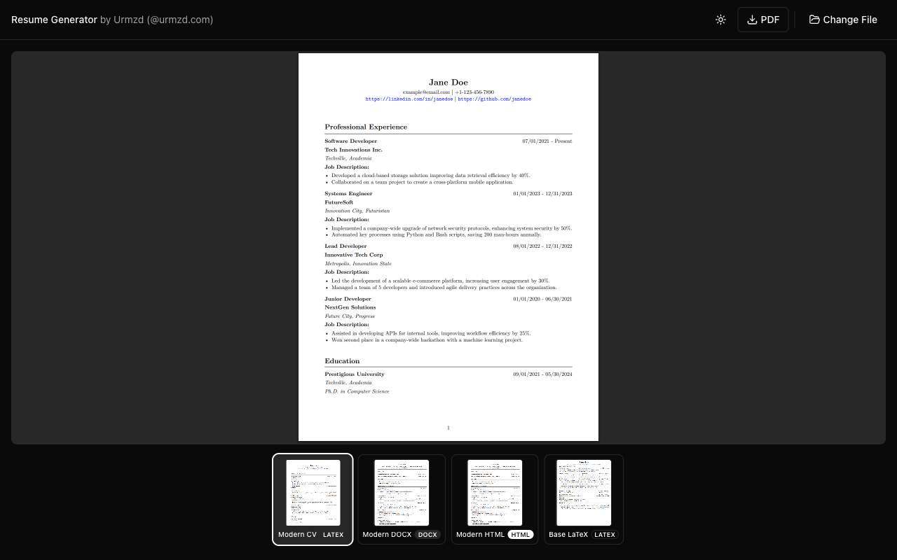
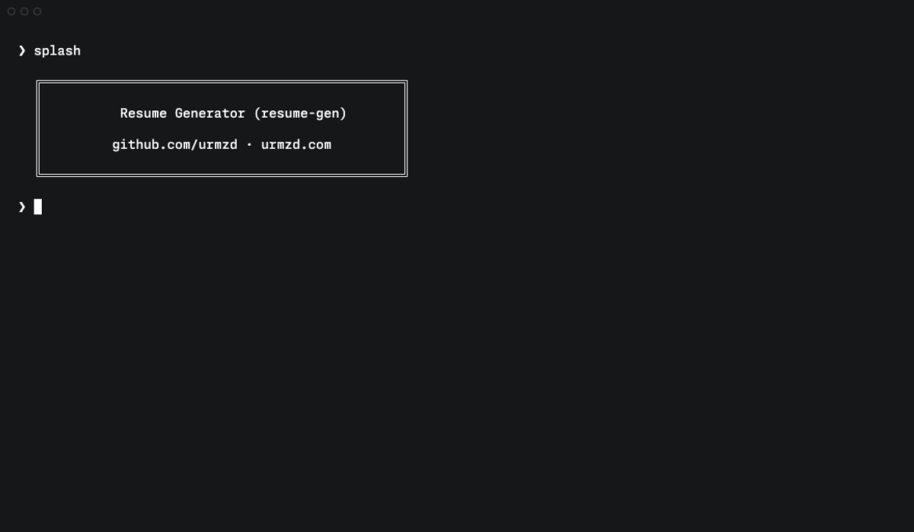

# Resume Generator

## Introduction

Resume Generator is a hybrid CLI + desktop GUI application for turning structured configuration files into polished resumes. Run the binary with no arguments to launch the desktop app, or pass arguments to use the CLI. It supports multiple template formats — LaTeX, HTML, and DOCX — and ships with a flexible template system so you can generate professional PDFs and Word documents from YAML, JSON, or TOML data.

## Showcase

### Output Examples

<p align="center">
  
  &nbsp;&nbsp;
  
</p>
<p align="center"><em>Left: Modern HTML template | Right: Modern LaTeX template</em></p>

### Desktop App

<p align="center">
  
</p>
<p align="center"><em>Native desktop app with template gallery and live PDF preview</em></p>

### CLI

<p align="center">
  
</p>

## Features

### Core Capabilities
- **Desktop GUI**: Native desktop app with drag-and-drop resume files, live PDF preview, template gallery, and save as PDF/DOCX
- **Multiple Template Types**: Generate output from LaTeX, HTML, or DOCX templates with the same data model
- **DOCX Support**: Native Word document generation for easy editing in Microsoft Word or Google Docs
- **Data-Only Inputs**: Provide resume content as YAML, JSON, or TOML; the tool selects templates and output targets
- **Template System**: Modular templates with embedded assets; customize or create new templates per project
- **Robust Path Resolution**: Works from any directory, supports `~`, relative paths, and dated output workspaces

### Technical Features
- **CLI Commands**: Validate inputs, preview data, list templates, generate outputs, and export JSON schema (the GUI is also available for all generation tasks)
- **Schema Generation**: Generate JSON Schema for IDE integration and validation

## Prerequisites

### Required
- **Go 1.24+**
- **Node.js 22+** (for frontend build)
- **TeX Live** or compatible LaTeX engine (only needed for LaTeX templates)

### For Desktop Development
- [Wails CLI](https://wails.io) — required for building the desktop app and running dev mode

### Optional
- [just](https://github.com/casey/just) for helper commands

### Chromium (HTML → PDF)

Rod auto-downloads a compatible Chromium binary on first use — no manual installation required. To use an existing browser instead (useful for CI), set the `ROD_BROWSER_BIN` environment variable:

```bash
export ROD_BROWSER_BIN="/usr/bin/chromium-browser"
```

## Getting Started

### Quick Start (CLI)

1. **Clone the Repository**
   ```bash
   git clone https://github.com/urmzd/resume-generator.git
   cd resume-generator
   ```

2. **Build the CLI**
   ```bash
   go build -o resume-generator .
   ```

3. **Generate a Resume**
   ```bash
   ./resume-generator run -i assets/example_resumes/software_engineer.yml -t modern-html
   ```

### Desktop App

Pre-built desktop binaries for **macOS**, **Linux**, and **Windows** are available on the [Releases](https://github.com/urmzd/resume-generator/releases) page. Download the latest release for your platform and run it — no build tools required.

To build from source instead (requires Wails CLI):

1. **Build the desktop app**:
   ```bash
   wails build
   ```

2. **Launch the GUI** by running the binary with no arguments:
   ```bash
   ./build/bin/resume-generator
   ```

> **Note:** `go build` produces a CLI-only binary (no GUI). Use `wails build` for the full desktop app with embedded frontend.

## CLI Usage

1. **Generate Resume**
   ```bash
   # Generate PDF from an HTML template
   ./resume-generator run -i assets/example_resumes/software_engineer.yml -t modern-html

   # Generate an editable DOCX
   ./resume-generator run -i assets/example_resumes/software_engineer.yml -t modern-docx

   # Generate with multiple templates (creates separate outputs for each)
   ./resume-generator run -i assets/example_resumes/software_engineer.yml -t modern-html -t modern-latex

   # Generate with all available templates (if -t is omitted)
   ./resume-generator run -i assets/example_resumes/software_engineer.yml

   # Use comma-separated template names
   ./resume-generator run -i assets/example_resumes/software_engineer.yml -t modern-html,modern-latex

   # Custom output root with multiple templates
   ./resume-generator run -i assets/example_resumes/software_engineer.yml -o outputs/custom-run -t modern-html -t modern-latex

   # Validate configuration
   ./resume-generator validate assets/example_resumes/software_engineer.yml

   # Preview without generation
   ./resume-generator preview assets/example_resumes/software_engineer.yml

   # List available templates
   ./resume-generator templates list

   # Check available LaTeX engines
   ./resume-generator templates engines
   ```

2. **Path Resolution**

   The CLI supports flexible path resolution:
   - **Relative paths**: `./assets/example_resumes/software_engineer.yml`, `../data/resume.yml`
   - **Absolute paths**: `/Users/name/Documents/resume.yml`
   - **Home directory**: `~/Documents/resume.yml`
   - **Custom output locations**: Specify any directory path for generated artifacts
   - **Directory output**: Provide a directory, and a dated workspace will be created (with PDF + debug artifacts)
   - **Aliases**: Use `-o`/`--output-dir` (alias `--output-root`) to control the root output folder

   Examples:
   ```bash
   # Relative input, custom output root
   ./resume-generator run -i assets/example_resumes/software_engineer.yml -o outputs/my_resume

   # Absolute paths
   ./resume-generator run -i /path/to/resume.yml -o /path/to/output-directory

   # Home directory paths
   ./resume-generator run -i ~/resumes/resume.yml -o ~/Documents/resumes

   # Output to directory (creates dated workspace)
   ./resume-generator run -i resume.yml -o ~/Documents/resume-exports
   ```

   Each run results in structured directories:
   - Single template: `outputs/first[_middle]_last/YYYY-MM-DD/<template_name>/first[_middle]_last_resume.pdf`
   - Multiple templates: Each template gets its own subdirectory with the same structure
   - Debug artifacts: A matching `<resume_basename>_debug/` folder in each template directory preserves the rendered `.tex`/`.html`, `.log`, `.aux`, and supporting class files.

   For example, when generating with multiple templates:
   ```
   ~/Documents/ResumeGeneratorOutputs/
   └── john_doe/
       └── 2025-10-25/
           ├── modern_html/
           │   ├── john_doe_resume.pdf
           │   └── john_doe_resume_debug/
           │       └── john_doe_resume.html
           └── modern_latex/
               ├── john_doe_resume.pdf
               └── john_doe_resume_debug/
                   ├── john_doe_resume.tex
                   ├── john_doe_resume.log
                   └── john_doe_resume.aux
   ```

## Desktop App

Run the binary with no arguments to launch the GUI:

```bash
./resume-generator
```

The desktop app provides:
- **Template gallery** — browse and select from available templates
- **Live PDF preview** — see your resume rendered in real time
- **Native file picker** — open resume data files (YAML, JSON, TOML) via drag-and-drop or file dialog
- **Export** — save output as PDF or DOCX

## Templates and Data

- **HTML Templates**: Modern responsive templates in `templates/*-html/`
- **LaTeX Templates**: LaTeX-based templates in `templates/*-latex/`
- **DOCX Templates**: Editable Word document templates in `templates/*-docx/`
- **Custom Templates**: Create your own templates following the provided patterns

Resume inputs should contain only the data you want to render — template selection, output formats, and destination paths are handled entirely by the CLI or the desktop app.

Use the CLI to explore or apply templates:

```bash
# List available templates
./resume-generator templates list

# Generate a resume with a specific template
./resume-generator run -i resume.yml -t custom-template
```

## Customization

To customize your resume, edit the source data file (e.g., `software_engineer.yml`) with your personal information, experiences, and skills. The tool supports YAML, JSON, and TOML inputs.

## Advanced Usage

### Using Just Command Runner

The project includes a `justfile` with convenient commands:

```bash
# Install Go deps + npm packages
just init

# Build CLI-only binary (no GUI, no CGO)
just install

# Build desktop app with Wails
just build-desktop

# Build CLI and generate a resume (default example input)
just run

# Generate with custom input/output/template
just run assets/example_resumes/software_engineer.yml outputs -t modern-html

# Wails dev mode with hot reload
just dev

# Clean frontend cache and rebuild, then start dev mode
just dev-clean
```

> The preview helpers look for `magick`, `convert`, or `pdftoppm`. Install ImageMagick or poppler-utils to enable the conversion.

## Templates

Built-in templates live in the `templates/` directory, one folder per template (for example, `templates/modern-html/template.html` or `templates/modern-latex/template.tex`). Each template ships with a `config.yml` describing its format (`html`, `latex`, or `docx`) and any supporting metadata. LaTeX templates bundle their required `.cls` or helper files directly alongside the template, so no additional classes directory is needed.

## Contributing

Contributions to the Resume Generator project are welcome. Please read [CONTRIBUTING.md](CONTRIBUTING.md) for detailed guidelines on:

- Development setup and workflow
- Code style and conventions
- Testing requirements
- Pull request process
- Adding new templates
- Documentation standards

Submit pull requests for any enhancements, bug fixes, or documentation improvements.
