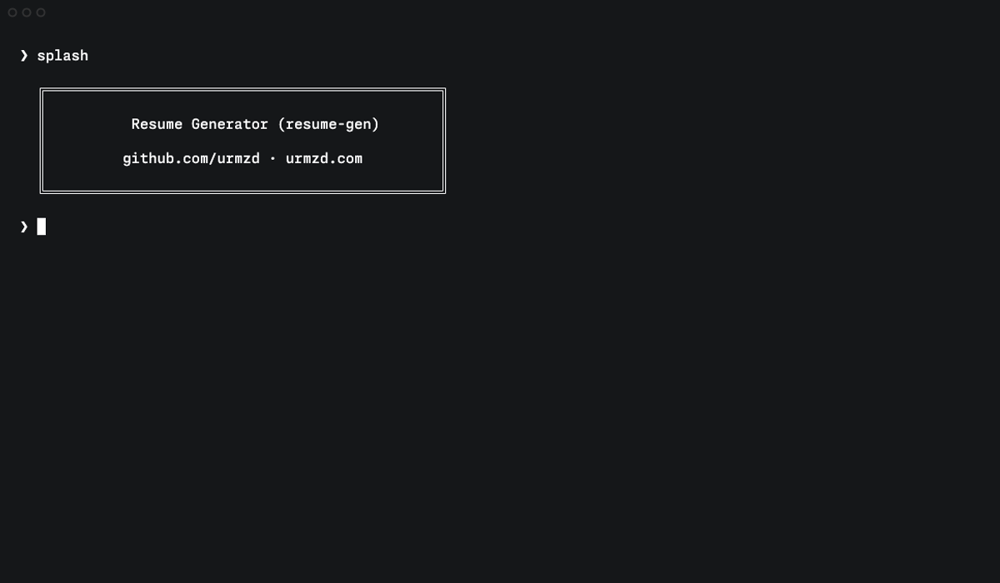
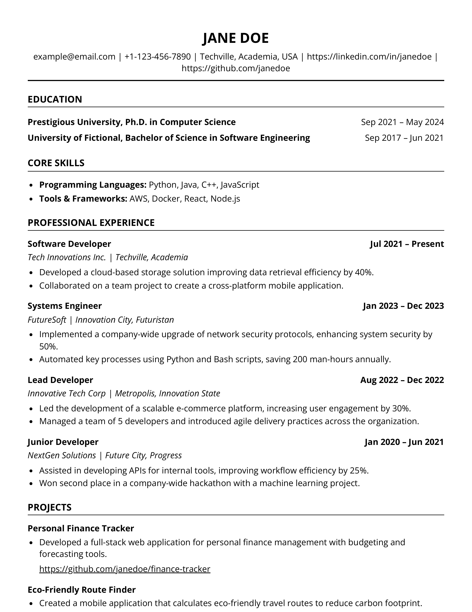

<p align="center">
  <h1 align="center">Resume Generator</h1>
  <p align="center">
    A CLI tool that converts structured resume data (YAML/JSON/TOML) into polished PDFs, HTML, LaTeX, DOCX, and Markdown.
    <br /><br />
    <a href="https://github.com/urmzd/resume-generator/releases">Download</a>
    &middot;
    <a href="https://github.com/urmzd/resume-generator/issues">Report Bug</a>
    &middot;
    <a href="https://github.com/urmzd/resume-generator-app">Desktop App</a>
  </p>
</p>

<br />

<p align="center">
  
</p>

## Output Examples

<p align="center">
  
  &nbsp;
  
  &nbsp;
  
</p>
<p align="center">
  <em>Modern HTML &nbsp;&middot;&nbsp; Modern LaTeX &nbsp;&middot;&nbsp; Modern CV</em>
</p>

## Features

- **Multiple Output Formats** — generate PDFs from LaTeX or HTML templates, plus native DOCX and Markdown
- **Data-Driven** — provide resume content as YAML, JSON, or TOML; the tool handles rendering
- **Template System** — modular templates with embedded assets; customize or create your own
- **AI Resume Assessment** — rate your resume with multi-agent LLM analysis via Ollama
- **Flexible Paths** — supports `~`, relative paths, and creates dated output workspaces
- **Schema Generation** — export JSON Schema for IDE autocompletion and validation

## Install

### Pre-built Binary

```bash
curl -fsSL https://raw.githubusercontent.com/urmzd/resume-generator/main/install.sh | bash
```

Supports **macOS** (Apple Silicon) and **Linux** (x86_64). After installation, run `resume-generator` from anywhere.

### Build from Source

```bash
git clone https://github.com/urmzd/resume-generator.git
cd resume-generator
go build -o resume-generator .
```

## Quick Start

```bash
# Generate PDF with a specific template
./resume-generator run -i assets/example_resumes/software_engineer.yml -t modern-html

# Generate with all templates
./resume-generator run -i assets/example_resumes/software_engineer.yml

# Generate an editable DOCX
./resume-generator run -i resume.yml -t modern-docx

# Validate input data
./resume-generator validate resume.yml

# List available templates
./resume-generator templates list

# AI assessment (requires Ollama)
./resume-generator assess -i resume.yml
```

## CLI Usage

### Generate

```bash
# Single template
./resume-generator run -i resume.yml -t modern-html

# Multiple templates
./resume-generator run -i resume.yml -t modern-html -t modern-latex

# Comma-separated
./resume-generator run -i resume.yml -t modern-html,modern-latex

# Custom output directory
./resume-generator run -i resume.yml -o outputs/custom -t modern-html
```

### Other Commands

```bash
./resume-generator validate resume.yml          # Validate resume data
./resume-generator preview resume.yml           # HTML live preview
./resume-generator templates list               # List templates
./resume-generator templates engines            # Check LaTeX engines
./resume-generator schema                       # Export JSON Schema
./resume-generator screenshots -i resume.yml    # Generate template screenshots
```

### Path Resolution

The CLI supports flexible path resolution — relative paths, absolute paths, `~` home directory expansion, and custom output locations. Each run creates a dated workspace:

```
~/Documents/ResumeGeneratorOutputs/
└── john_doe/
    └── 2025-10-25/
        ├── modern_html/
        │   └── john_doe_resume.pdf
        └── modern_latex/
            └── john_doe_resume.pdf
```

## Prerequisites

- **Go 1.24+**
- **TeX Live** (only for LaTeX templates)
- **Chromium** — auto-downloaded by Rod on first use, or set `ROD_BROWSER_BIN`
- [just](https://github.com/casey/just) (optional, for helper commands)
- [Ollama](https://ollama.com) (optional, for `assess` command)

## Templates

Built-in templates live in `templates/`, one folder per template with a `config.yml` and template file:

| Template | Format | Output |
|----------|--------|--------|
| `modern-html` | HTML | PDF via Chromium |
| `modern-latex` | LaTeX | PDF via TeX Live |
| `modern-cv` | LaTeX | PDF via TeX Live |
| `modern-docx` | DOCX | Word document |
| `modern-markdown` | Markdown | `.md` file |

Create your own by adding a `templates/<name>/` directory with `config.yml` + template file. See existing templates for patterns.

## Agent Skill

This project ships an [Agent Skill](https://github.com/vercel-labs/skills) for Claude Code, Cursor, and other compatible agents.

```sh
npx skills add urmzd/resume-generator
```

Once installed, use `/resume-generate` to generate resumes from your agent.

## Related

- [resume-generator-app](https://github.com/urmzd/resume-generator-app) — native desktop GUI with live preview, template gallery, and inline editing. If you prefer a visual interface over the command line, use the desktop app instead.

## Contributing

Contributions welcome. See [CONTRIBUTING.md](CONTRIBUTING.md) for guidelines.

## License

Apache 2.0
